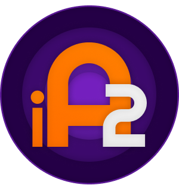
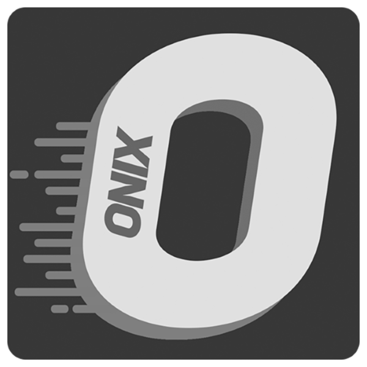
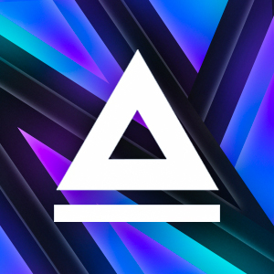

# IArena-2

### What is it ?

`IArena-2` is a rework of the original [IArena](https://github.com/alohner/iArena) game made by [@alohner](https://github.com/alohner), with its main objective to be more accessible by removing the necessity of installing the Unity Game Engine and being fully standalone.  
The content of this git in itself is the Unity project, and the Releases tab contains the standalone versions of the game.

In `IArena-2`, the player makes a script to control the IA of 3 kinds of units :
- `Control` : the central unit, the player must defend it from the enemy units, and losing it will end the game for this player.
- `Destructor` : the heavy unit, with a high health and a high attack power, but with a low movement speed, and a small vision cone.
- `Interceptor` : the light unit, with a lower health and a lower attack power, but with a higher movement speed, and a bigger vision cone.

# Table of Contents

- [Installation](#Installation)
- [Wiki](#Wiki)
- [Credits](#Credits)

# Installation

### Standalone version

1 • Download the .zip file from the Releases tab.  
2 • Extract the .zip file in the folder of your choice.  
3 • Open the `IArena-2.exe` file.

### Unity Project

1 • Clone this git or dowload it.  
2 • Open it in the Unity Editor.

📰 Recommanded version is `2021.2.19f1`

# Wiki

This git contains a wiki, with a lot more information about the game and its mechanics.  
You can check it by clicking the Wiki tab or [here](https://github.com/NeoOniX/IArena-2/wiki)

# Credits
This game is provided to you by :
-  [@NeoOniX](https://github.com/NeoOniX)
-  [@AssADev](https://github.com/AssADev)

Based on the original work [IArena](https://github.com/alohner/iArena) of :
-  [@alohner](https://github.com/alohner)